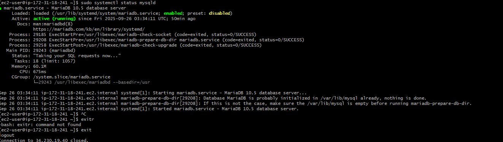
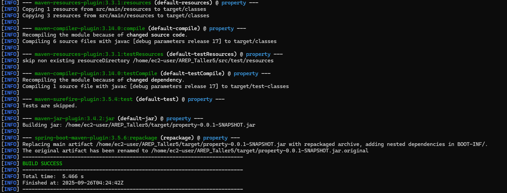
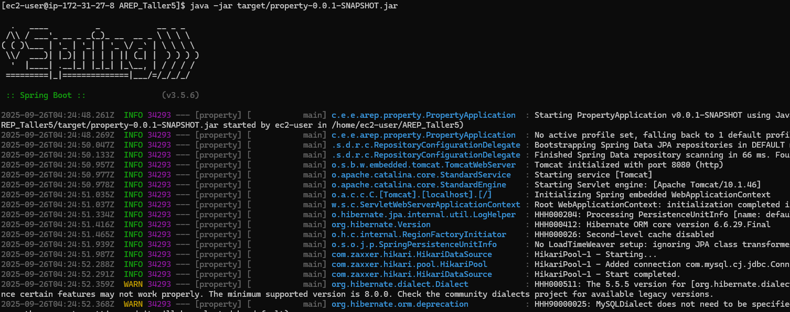
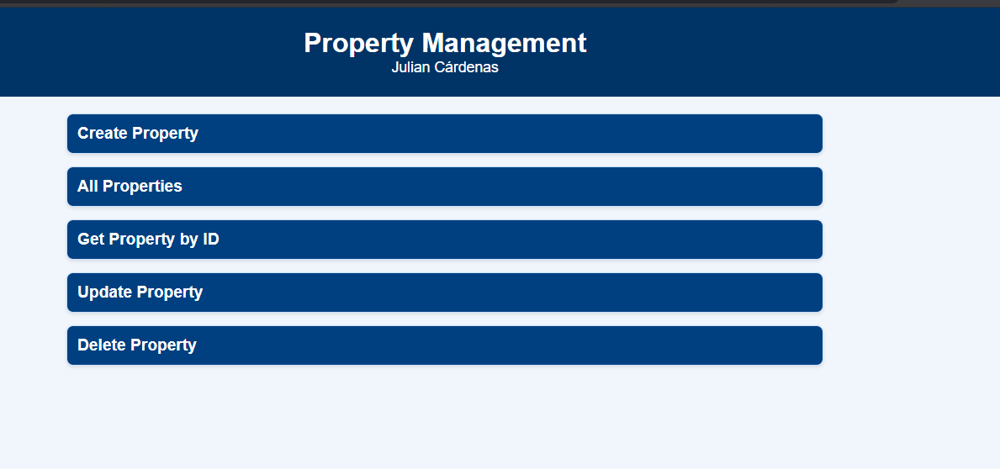
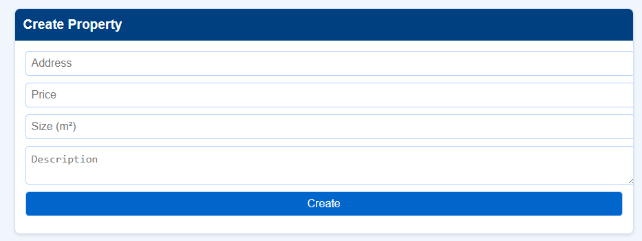

# Taller de Despliegue en AWS con Modularización y EC2

### DESCRIPCIÓN DEL PROYECTO

Este proyecto es una aplicación web en Java con Spring Boot que expone servicios REST para la gestión de propiedades (CRUD).
La arquitectura desplegada en AWS usa dos instancias EC2:

- **EC2 dedicada al backend** (Spring Boot y frontend estático en resources/static).
- **EC2 dedicada a la base de datos** (MariaDB/MySQL).

La comunicación entre backend y base de datos se realiza por la red privada (IP privada) dentro de la misma VPC.

---

### REQUISITOS

- Java 17 (o compatible)
- Maven
- Git
- Cuenta AWS y llaves SSH (.pem)
- Dos instancias EC2 en la misma VPC (Amazon Linux 2 recomendada)

### CLONAR EL REPOSITORIO (en tu máquina local)

```bash
git clone https://github.com/YulienCC2512/AREP_Taller5.git
cd AREP_Taller5
```

## CONSTRUIR EL PROYECTO (local o en la instancia backend)

```bash
mvn clean package 
```

Esto genera `target/property-0.0.1-SNAPSHOT.jar`

## CONFIGURACIÓN Y DESPLIEGUE EN AWS (dos instancias EC2)

### Instancia 1: mysql-server (Base de Datos)

**- Conectarse por SSH:**
```bash
ssh -i mi-llave.pem ec2-user@<IP_PUBLICA_MYSQL>
```

**- Actualizar e instalar:**
```bash
sudo yum update -y
sudo yum install -y mariadb105-server
```

**- Iniciar y habilitar el servicio:**
```bash
sudo systemctl start mariadb
sudo systemctl enable mariadb
```

**- Configurar para aceptar conexiones remotas:**
```
bind-address = 0.0.0.0
sudo systemctl restart mariadb
```

**- Entrar al cliente mysql y crear base y usuario:**
```bash
sudo mysql -u root -p
```
Dentro del prompt mysql ejecutar:
```sql
CREATE DATABASE propertydb;
CREATE USER 'admin'@'%' IDENTIFIED BY 'Local1';
GRANT ALL PRIVILEGES ON propertydb.* TO 'admin'@'%' WITH GRANT OPTION;
FLUSH PRIVILEGES;
EXIT;
```
**-  Verificacion Servicio Corriendo:**




### B) Instancia 2: backend-server (EC2 para Spring Boot)

**1. Conectarse por SSH:**
```bash
ssh -i mi-llave.pem ec2-user@100.27.191.32 
```

**2 clonar y compilar en la instancia:**
```bash
git clone https://github.com/YulienCC2512/AREP_Taller5.git
cd AREP_Taller5
mvn clean package -DskipTests
```

**3. Configurar application.properties para apuntar a la DB (usar IP privada del mysql-server):**

Editar `src/main/resources/application.properties` o crear archivo externo:
```properties
spring.datasource.url=jdbc:mysql://172.31.18.241:3306/propertydb?useSSL=false&serverTimezone=UTC
spring.datasource.username=admin
spring.datasource.password=Local1
spring.datasource.driver-class-name=com.mysql.cj.jdbc.Driver
spring.jpa.hibernate.ddl-auto=update
spring.jpa.show-sql=true
server.port=8080
```

**5. Ejecutar la aplicación:**
```bash
mvn clean package
java -jar /home/ec2-user/property-0.0.1-SNAPSHOT.jar
```






### C) Security Groups

**En el Security Group del mysql-server (SG-DB):**
- Type: MySQL/Aurora, Port: 3306, Source: el Security Group del backend (SG-BACKEND)

**En el Security Group del backend (SG-BACKEND):**
- Type: Custom TCP, Port: 8080, Source: tu IP pública (o 0.0.0.0/0 para pruebas)
- Type: SSH 22, Source: tu IP pública

## CÓMO PROBAR EL SERVICIO

### Desde la máquina local con curl (8080 ):

**Crear:**
```bash
curl -X POST http://http://100.27.191.32/:8080/api/properties \
  -H "Content-Type: application/json" \
  -d '{"address":"Calle 1","price":120000.0,"size":80.5,"description":"Prueba"}'
```

**Listar:**
```bash
curl http://http://100.27.191.32/:8080/api/properties
```

**Obtener por id:**
```bash
curl http://http://100.27.191.32/:8080/api/properties/1
```

**Actualizar:**
```bash
curl -X PUT http://http://100.27.191.32/:8080/api/properties/1 \
  -H "Content-Type: application/json" \
  -d '{"address":"Calle 2","price":130000.0,"size":85.0,"description":"Update"}'
```

**Eliminar:**
```bash
curl -X DELETE http://http://100.27.191.32/>:8080/api/properties/1
```

### Desde el navegador:

Abrir `http://http://100.27.191.32/:8080/`

Usar la interfaz para crear, listar, actualizar y eliminar.




## ESTRUCTURA DEL PROYECTO

```
src/main/java/com/edu/eci/arep/property/
├── controller/     → PropertyController
├── service/        → PropertyService
├── repository/     → PropertyRepository
├── model/          → Property
└── exception/      → manejadores de excepción

src/main/resources/
├── application.properties
└── static/         → index.html, style.css, app.js

pom.xml
target/             → jar generado
```

## EVIDENCIAS

- **Video de despliegue y demostración:** `Prueba-Funcionamiento.mp4` 
    


## AUTOR

**Julián Santiago Cárdenas Cubaque**