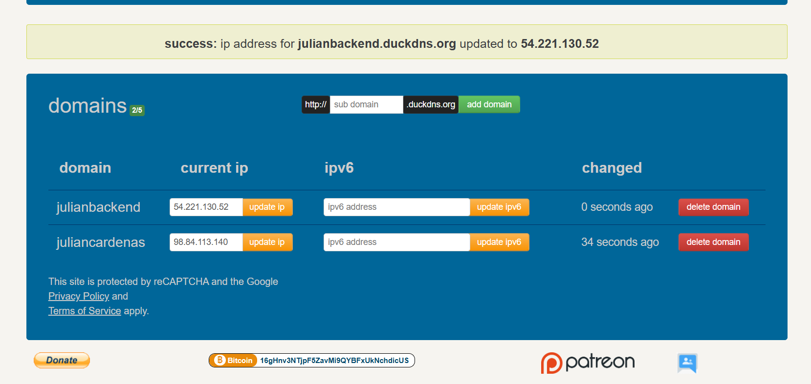

# Secure Application Design

### DESCRIPCIÓN DEL PROYECTO

Este laboratorio tiene como objetivo desplegar una aplicación web segura que combine un frontend estático servido desde Apache y un backend desarrollado en Spring Boot, ambos alojados dentro de una instancia EC2 de AWS.

La aplicación está diseñada bajo los principios de seguridad en aplicaciones distribuidas, implementando comunicación cifrada mediante HTTPS (SSL/TLS) con certificados generados por Let’s Encrypt y gestión de recursos mediante servicios REST.

El usuario accede inicialmente a un login seguro alojado en el servidor Apache, el cual envía las credenciales al backend para autenticación. Una vez validado, el usuario puede realizar operaciones CRUD sobre los recursos registrados en la base de datos.

---

### REQUISITOS

- Java 17 (o compatible)
- Spring Boot 3.x
- Maven
- Git
- DuckDNS
- Cuenta AWS y llaves SSH (.pem)
- Dos instancias EC2 en la misma VPC 


## CONFIGURACIÓN Y DESPLIEGUE EN AWS (dos instancias EC2)
### Despliegue del backend con Spring Boot

**- Clonar o subir el proyecto a la instancia: **
```bash
git clone https://github.com/YulienCC2512/AREP_SecureApplicationDesign.git
cd AREP_SecureApplicationDesign
```
**- Compilar el proyecto: **
```bash
mvn clean package -DskipTests
```

**- Ejecutar el backend:**
```bash
java -jar target/property-0.0.1-SNAPSHOT.jar
```

**- Verificar que el backend esta activo**
```bash
http://<ip_publica>:8080/api/properties
```


### Configuacion de Apache como seridor HTTPS

**- Actualizar e instalar Apache:**
```bash
sudo dnf update -y
sudo dnf install -y httpd
```
**- Instalar Certbot oara generar certificados SSL**
```bash
sudo yum install python3-certbot-apache -y
```

**- Configurar DuckDNS para un dominio gratuito:**

**- Solicitar el certificado para el dominio deseado: En este caso: `julianbackend.duckdns.org` y `juliancardenas.duckdns.org`**
```bash
sudo certbot --apache -d julianbackend.duckdns.org -m santiago.cc2512@gmail.com --agree-tos --no-eff-email
```
 Esto genera automaticamente los archivos: `/etc/letsencrypt/live/julianbackend.duckdns.org/fullchain.pem` y `/etc/letsencrypt/live/julianbackend.duckdns.org/privkey.pem`


**-. Verificar que Apache este corriendo:**
```bash
sudo systemctl start httpd
sudo systemctl status httpd
```

### Configuracion de los archivos web de Apache

1. Mover los archivos del frontend a la instancia EC2 del Apache:
```bash
sudo mv /home/ec2-user/AREP_SecureApplicationDesign/static/* /var/www/html/
```
2. Asegurarse de que el login (login.html y login.js) apunten al backend con HTTPS:
```
const response = await fetch("https://julianbackend.duckdns.org/api/properties/login", { ... })
```
3. Reiniciar Apache:
```bash
sudo systemctl restart httpd
```


### Security Groups

**En el Security Group del backend (SG-BACKEND):**
- Type: Custom TCP, Port: 8080, Source: tu IP pública (o 0.0.0.0/0 para pruebas)
- Type: SSH 22, Source: tu IP pública

## CÓMO PROBAR EL SERVICIO

### Desde la máquina local con curl (8080 ):

**Crear:**
```bash
curl -X POST http://http://100.27.191.32/:8080/api/resources \
  -H "Content-Type: application/json" \
  -d '{"address":"Calle 1","price":120000.0,"size":80.5,"description":"Prueba"}'
```

**Listar:**
```bash
curl http://http://100.27.191.32/:8080/api/resources
```

**Obtener por id:**
```bash
curl http://http://100.27.191.32/:8080/api/resources/1
```

**Actualizar:**
```bash
curl -X PUT http://http://100.27.191.32/:8080/api/resources/1 \
  -H "Content-Type: application/json" \
  -d '{"address":"Calle 2","price":130000.0,"size":85.0,"description":"Update"}'
```

**Eliminar:**
```bash
curl -X DELETE http://http://100.27.191.32/>:8080/api/properties/1
```


## ARQUITECTURA DEL PROYECTO


```
src/main/java/com/edu/eci/arep/property/
├── controller/     → ResourceController
├── service/        → ResourceService
├── repository/     → ResourceRepository
├── model/          → Resource
└── exception/      → manejadores de excepción

src/main/resources/
├── application.properties
└── static/         → index.html, style.css, app.js

pom.xml
target/             → jar generado
```


## EVIDENCIAS

- **Video de despliegue y demostración:** `Prueba-Funcionamiento.mp4` 
    


## AUTOR

**Julián Santiago Cárdenas Cubaque**